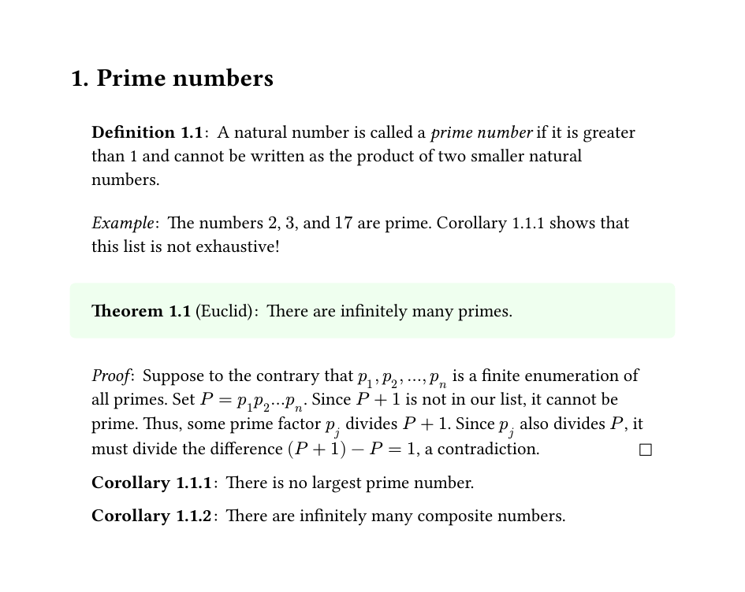

# typst-theorems

An implementation of numbered theorem environments in
[typst](https://github.com/typst/typst).
Available as
[ctheorems](https://github.com/typst/packages/tree/main/packages/preview/ctheorems/1.1.2)
in the official Typst [packages](https://github.com/typst/packages/tree/main).
Import with

```typst
#import "@preview/ctheorems:1.1.2": *
#show: thmrules
```

Alternatively, copy and import the [theorems.typ](theorems.typ) file to use in
your own projects.

### Features
- Numbered theorem environments can be created and customized.
- Environments can share the same counter, via same `identifier`s.
- Environment counters can be _attached_ (just as subheadings are attached to headings) to other environments, headings, or keep a global count via `base`.
- The depth of a counter can be manually set, via `base_level`.
- Environments can be `<label>`'d and `@reference`'d.

## Manual and Examples
Get acquainted with `typst-theorems` by checking out the minimal example below!

You can read the [manual](manual.pdf) for a full walkthrough of functionality offered by this module; flick through [manual_examples](manual_examples.pdf) and its [typ file](manual_examples.typ) to just see the examples.

The [differential_calculus.typ](differential_calculus.typ) ([render](differential_calculus.pdf)) project provides a practical use case. _(Hastily translated from my notes written in LaTeX)_



### Preamble
```typst
#import "theorems.typ": *
#show: thmrules.with(qed-symbol: $square$)

#set page(width: 16cm, height: auto, margin: 1.5cm)
#set text(font: "Linux Libertine", lang: "en")
#set heading(numbering: "1.1.")

#let theorem = thmbox("theorem", "Theorem", fill: rgb("#eeffee"))
#let corollary = thmplain(
  "corollary",
  "Corollary",
  base: "theorem",
  titlefmt: strong
)
#let definition = thmbox("definition", "Definition", inset: (x: 1.2em, top: 1em))

#let example = thmplain("example", "Example").with(numbering: none)
#let proof = thmproof("proof", "Proof")
```

### Document
```typst
= Prime numbers

#definition[
  A natural number is called a #highlight[_prime number_] if it is greater
  than 1 and cannot be written as the product of two smaller natural numbers.
]
#example[
  The numbers $2$, $3$, and $17$ are prime.
  @cor_largest_prime shows that this list is not exhaustive!
]

#theorem("Euclid")[
  There are infinitely many primes.
]
#proof[
  Suppose to the contrary that $p_1, p_2, dots, p_n$ is a finite enumeration
  of all primes. Set $P = p_1 p_2 dots p_n$. Since $P + 1$ is not in our list,
  it cannot be prime. Thus, some prime factor $p_j$ divides $P + 1$.  Since
  $p_j$ also divides $P$, it must divide the difference $(P + 1) - P = 1$, a
  contradiction.
]

#corollary[
  There is no largest prime number.
] <cor_largest_prime>
#corollary[
  There are infinitely many composite numbers.
]

#theorem[
  There are arbitrarily long stretches of composite numbers.
]
#proof[
  For any $n > 2$, consider $
    n! + 2, quad n! + 3, quad ..., quad n! + n #qedhere
  $
]
```


## Acknowledgements

Thanks to

- [MJHutchinson](https://github.com/MJHutchinson) for suggesting and
  implementing the `base_level` and `base: none` features,
- [rmolinari](https://github.com/rmolinari) for suggesting and
  implementing the `separator: ...` feature,
- [DVDTSB](https://github.com/DVDTSB) for contributing
  - the idea of passing named arguments from the theorem directly to the `fmt`
    function.
  - the `number: ...` override feature.
  - the `title: ...` override feature in `thmbox`.
- The awesome devs of [typst.app](https://typst.app/) for their
  support.
